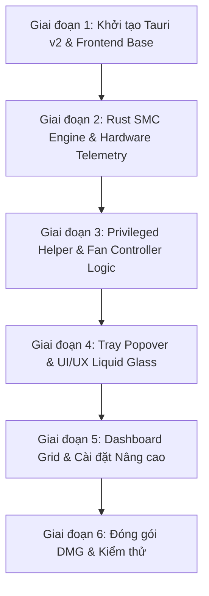

# Kế hoạch Chuyển đổi SuperFan: Swift/SwiftUI (SoloFan) ➔ Tauri v2 + Rust + React

Tài liệu này phác thảo kế hoạch kiến trúc và lộ trình chuyển đổi ứng dụng theo dõi nhiệt độ và điều khiển quạt **SoloFan** (viết bằng Swift/SwiftUI trên macOS) sang **SuperFan** sử dụng **Tauri v2 + Rust + React (Vite + Tailwind CSS)**.

---

## 1. Tổng quan & Mục tiêu

* **Dự án nguồn (`/Users/beowulf/Work/solofan`)**: Ứng dụng menu bar macOS viết bằng Swift/SwiftUI, giao tiếp SMC bằng C (`smc.c`/`smc.h`) và daemon trợ giúp (`smc-helper`).
* **Dự án đích (`/Users/beowulf/Work/personal/superfan`)**: Ứng dụng **SuperFan** viết trên Tauri v2 với:
  * **Core Engine (Rust)**: Đọc/ghi SMC trực tiếp thông qua IOKit FFI, quản lý daemon/helper có quyền root, phát các sự kiện phần cứng theo thời gian thực.
  * **Giao diện (React + Vite + Tailwind CSS + Lucide Icons + Framer Motion)**: Thiết kế Liquid Glass/Glassmorphism hiện đại, hỗ trợ Popover Menu Bar, Dashboard tùy chỉnh widget và bảng điều khiển nâng cao.

---

## 2. Bảng ánh xạ Kiến trúc (Architecture Mapping)

| Thành phần SoloFan (Swift) | Ghi chú chức năng | Thành phần SuperFan (Tauri v2 + Rust + React) |
| :--- | :--- | :--- |
| `smc.c` / `smc.h` | Thư viện C truy cập IOKit đọc/ghi SMC key | `src-tauri/src/smc/` (Rust FFI với IOKit / bind `smc.c`) |
| `SystemMonitor.swift` | Đọc nhiệt độ CPU/GPU, RPM quạt, pin | Rust Background Thread (Async telemetry loop + `app.emit()`) |
| `FanController.swift` | Logic điều khiển quạt (Manual & Auto Curve) | Rust `FanController` struct / Tauri Commands (`set_fan_mode`, `set_fan_speed`) |
| `tools/smc-helper` | Privileged Helper daemon ghi SMC với quyền root | Sidecar Rust binary hoặc Helper Tool cài đặt trong `/Library/PrivilegedHelperTools` |
| `StatusBarManager.swift` / `PopoverView.swift` | Menu bar icon & popover window | Tauri v2 `TrayIcon` + `tauri-plugin-positioner` + Frameless Window |
| `DashboardGridView.swift` | Dashboard tùy biến dạng lưới | React Grid Layout (`react-grid-layout` / CSS Grid) + Custom Widgets |
| `LaunchAtLoginManager.swift` | Khởi động cùng hệ thống (SMAppService) | `tauri-plugin-autostart` |
| `SettingsView.swift` / Preferences | Cài đặt ứng dụng | React Settings Modal + `tauri-plugin-store` |

---

## 3. Lộ trình Triển khai (Implementation Roadmap)

---

### Giai đoạn 1: Khởi tạo Tauri v2 & Structure
* Khởi tạo dự án Tauri v2 (`npm create tauri-app@latest ./ -- --template react-ts`).
* Cấu hình Tailwind CSS, Lucide Icons, Framer Motion.
* Cấu hình các Tauri plugins cần thiết:
  * `tauri-plugin-positioner` (xác định vị trí Popover dưới Tray Icon).
  * `tauri-plugin-autostart` (Tự động chạy khi đăng nhập).
  * `tauri-plugin-store` (Lưu cấu hình người dùng).

### Giai đoạn 2: Rust SMC Engine & Hardware Telemetry
* Đưa thư viện FFI `smc.c`/`smc.h` hoặc sử dụng IOKit-sys vào Rust backend (`src-tauri/src/smc/`).
* Định nghĩa cấu trúc dữ liệu cho:
  * `SensorData`: Tên cảm biến, mã SMC Key, giá trị (°C).
  * `FanData`: ID quạt, RPM hiện tại, RPM tối thiểu/tối đa, mode (Auto/Manual).
  * `BatteryData`: Phần trăm, nhiệt độ, công suất (W), số chu kỳ sạc.
* Xây dựng luồng chạy ngầm (Background Async Loop) quét dữ liệu định kỳ (mặc định 1s/lần) và phát sự kiện `telemetry-update` tới Frontend.

### Giai đoạn 3: Privileged Helper & Điều khiển Quạt
* **Phân tích quyền hạn SMC trên macOS**:
  * Đọc SMC key (`TC0P`, `F0Ac`,...): Không cần root.
  * Ghi SMC key (`F0Tg`, `F0Md`, `FS!`): Yêu cầu quyền Root/Admin.
* **Giải pháp Helper Tool**:
  * Biên dịch `smc-helper` thành binary nhỏ độc lập.
  * Tích hợp helper installer trong Rust: Prompt người dùng cấp quyền qua `osascript` / `STPrivilegedTask` / `AuthorizationExecuteWithPrivileges` một lần duy nhất để cài vào `/Library/PrivilegedHelperTools/` hoặc `/usr/local/bin/`.
* Xây dựng Thuật toán Điều khiển Quạt trong Rust:
  * **Manual Mode**: Đặt tốc độ cố định theo slider.
  * **Automatic/Curve Mode**: Tính toán tuyến tính RPM theo ngưỡng nhiệt độ CPU/GPU và override max speed ở 95°C+.

### Giai đoạn 4: Menu Bar Tray Popover & UI Liquid Glass
* Tạo `TrayIcon` trong Tauri v2:
  * Hiển thị nhiệt độ CPU/GPU ngắn gọn trên Status Bar (vd: `🔥 48°C`).
  * Click vào icon toggle cửa sổ Popover (ẩn/hiện với hiệu ứng mượt).
* Thiết kế Giao diện Liquid Glass (Popover):
  * Cửa sổ tràn viền không viền (`decorations: false`, hiệu ứng `vibrancy` của macOS).
  * Thẻ tổng quan nhanh: Nhiệt độ CPU/GPU hiện tại, Tốc độ quạt, Nút chuyển chế độ Auto/Manual nhanh.

### Giai đoạn 5: Custom Dashboard Grid & Settings
* **Dashboard Widgets**:
  * Widget nhiệt độ chi tiết từng core CPU / GPU.
  * Widget biểu đồ đường theo thời gian thực (Temp History graph).
  * Widget điều khiển quạt độc lập (Slider RPM, Min/Max gauge).
  * Widget pin & điện năng tiêu thụ.
* **Trang Cài đặt (Settings)**:
  * Đơn vị nhiệt độ (°C / °F).
  * Tần suất làm tươi (Polling interval: 0.5s - 5s).
  * Khởi động cùng hệ thống.
  * Quản lý trạng thái Helper Tool (Check, Install, Uninstall).
  * Chế độ Demo Mode (mô phỏng dữ liệu thử nghiệm UI).

### Giai đoạn 6: Đóng gói DMG & Automation
* Viết script build DMG tự động cho Apple Silicon (M1/M2/M3/M4) và Intel (`universal2-apple-darwin`).
* Tích hợp CI/CD GitHub Actions phát hành release tự động.

---

## 4. Bảng danh sách SMC Keys quan trọng

| Mã SMC Key | Loại dữ liệu | Mô tả |
| :--- | :--- | :--- |
| `TC0P`, `TCXC`, `TC0D`,... | `flt` / `sp78` / `fpe2` | Nhiệt độ các nhân CPU |
| `TG0P`, `TG0D`, `TGDD`,... | `flt` / `sp78` / `fpe2` | Nhiệt độ GPU |
| `Tp09`, `Tp0T`, `Tp0D`,... | `flt` / `sp78` / `fpe2` | Cảm biến SoC Apple Silicon |
| `F0Ac`, `F1Ac` | `fpe2` / `ui16` | Tốc độ quạt thực tế (RPM) |
| `F0Mn`, `F0Mx` | `fpe2` / `ui16` | Tốc độ quạt tối thiểu / tối đa |
| `F0Tg`, `F1Tg` | `fpe2` / `ui16` | Tốc độ quạt mục tiêu (Manual set) |
| `F0Md` | `ui8` | Chế độ quạt (0 = Auto, 1 = Manual) |
| `FS! ` | `bytes` | Bitmask ép buộc chế độ điều khiển quạt |

---

## 5. Các bước thực hiện tiếp theo

1. **Khởi tạo bộ khung dự án Tauri v2** trong repo `superfan`.
2. **Import các file thư viện SMC C (`smc.c`/`smc.h`)** vào thư mục `src-tauri` và thiết lập FFI binding.
3. **Phát triển UI React Popover** với phong cách Liquid Glass ấn tượng.
